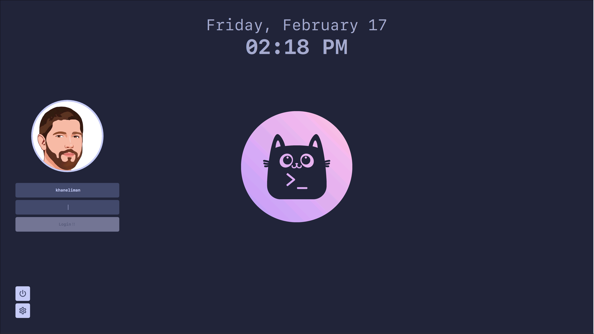

# Catppuccin SDDM

[Catppuccin](https://github.com/catppuccin/catppuccin) Theme for [SDDM](https://github.com/sddm/sddm). Forked from [Corners]() and customized for Catppuccin setups.



## Dependencies

- SDDM
- Qt5
- Qt Graphical Effects
- Qt SVG
- Qt Quick Controls 2

### Arch

```bash
pacman -Syu sddm qt5-graphicaleffects qt5-svg qt5-quickcontrols2
```

## Installation

### NixOS

This theme is available in the [Nixpkgs repo](https://github.com/NixOS/nixpkgs/blob/nixos-unstable/pkgs/by-name/ca/catppuccin-sddm-corners/package.nix)
You can just add the package and reference the output for the theme.

```nix
environment.packages = with pkgs; [ catppuccin-sddm-corners ];

...

services.displayManager.sddm = {
    enable = true;
    theme = "catppuccin-sddm-corners";
};

```

If you'd like to use the flake. Just add this flake as an input and reference its package output for installation. Then use it within your config by name for sddm theme.

```nix
inputs.sddm-catppuccin.url = "github:khaneliman/catppuccin-sddm-corners";
inputs.sddm-catppuccin.inputs.nixpkgs.follows = "nixpkgs";

...

inputs.sddm-catppuccin.packages.${pkgs.hostPlatform.system}.catppuccin-sddm-corners

...

services.displayManager.sddm = {
    enable = true;
    theme = "catppuccin-sddm-corners";
};
```

### AUR

The theme is available from the AUR [here](https://aur.archlinux.org/packages/sddm-catppuccin-git). Install it with your favorite AUR helper: `paru sddm-catppuccin-git`

### Manual

Simply clone this repo, and copy the `catppuccin/` folder to `/usr/share/sddm/themes/`.

```bash
git clone https://github.com/khaneliman/catppuccin-sddm-corners.git
cd catppuccin-sddm-corners
cp -r catppucin/ /usr/share/sddm/themes/
```

Make sure to change the current theme that SDDM is using. on Arch, create a config file in `/etc/sddm.conf.d/` with the following contents:

```conf
[Theme]
Current=catppuccin
```

## Configuration

You will probably want to configure the theme before using it, as out of the box it uses [Liga SFMono Nerd Font](https://github.com/shaunsingh/SFMono-Nerd-Font-Ligaturized) as the display font.

Edit the `theme.conf` file (located inside `catppuccin/`) as you see fit. The following are short descriptions of what each option does.

_note that colors require the leading `#` and that all options have to be wrapped in quotation marks. refer to [this](https://doc.qt.io/qt-5/qml-color.html) link for more info regarding colors._

### General

- `Background`: path to the wallpaper. you can drop files in `backgrounds/` to use a relative path, or you can just use an absolute path.
- `Font`: the font to use throughout the theme. use the name of the font family.
- `Padding`: the distance that stuff should be from the screen edge.
- `CornerRadius`: specify how round corners should be, or set to 0 to disable rounded corners.
- `GeneralFontSize`: the font size used for everything excluding the date and time.
- `LoginScale`: this allows you to adjust the relative scale of UI elements. you should probably keep the value below 1.

### User picture

click on the avatar to change users!

- `UserPictureBorderWidth`: the width of the outline around the user avatar. set to 0 to disable.
- `UserPictureBorderColor`: the color of the outline around the user avatar.
- `UserPictureColor`: the color of the default, blank avatar. note that this is only visible when you don't have a custom picture set.

### Text field (user and password)

- `TextFieldColor`: the color of the text field background for the user and password fields.
- `TextFieldTextColor`: the color of the text inside the user and password fields.
- `TextFieldHighlightColor`: the color of the border around the currently selected text field.
- `TextFieldHighlightWidth`: the border width of the currently selected text field. set to 0 to disable the border.
- `UserFieldBgText`: the placeholder text shown in the user field when nothing is typed.
- `PasswordFieldBgText`: the placeholder text shown in the password field when nothing is typed.

### Login button

- `LoginButtonTextColor`: the color of the login button text.
- `LoginButtonBgColor`: the color of the login button background.
- `LoginButtonText`: the text to be displayed on the login button.

### Popup (power, session, and user)

- `PopupBgColor`: the background color of the popup. this applies to the power panel, session panel, and user panel.
- `PopupHighlightColor`: the color of the currently selected entry in the popup. this applies to the power panel, session panel, and user panel.
- `PopupHighlightedTextColor`: the color of the text for the currently selected option. only applies to session and user popups.

### Session button

- `SessionButtonColor`: the color of the session button background.
- `SessionIconColor`: the color of the icon inside the session button.

### Power button

- `PowerButtonColor`: the color of the power button background.
- `PowerIconColor`: the color of the icon inside the session button.

### Date

- `DateColor`: the text color of the date.
- `DateSize`: the font size of the date.
- `DateIsBold`: whether the date is bolded. accepts either `true` or `false`.
- `DateOpacity`: the opacity of the date text. set to 1 to disable transparency.
- `DateFormat`: specify the formatting of the date.

### Time

- `TimeColor`: the text color of the time.
- `TimeSize`: the font size of the time.
- `TimeIsBold`: whether the time is bolded. accepts either `true` or `false`.
- `TimeOpacity`: the opacity of the time text. set to 1 to disable transparency.
- `TimeFormat`: specify the formatting of the time.

## License

This project is licensed under the GPLv3 License. check it out [here](LICENSE).
